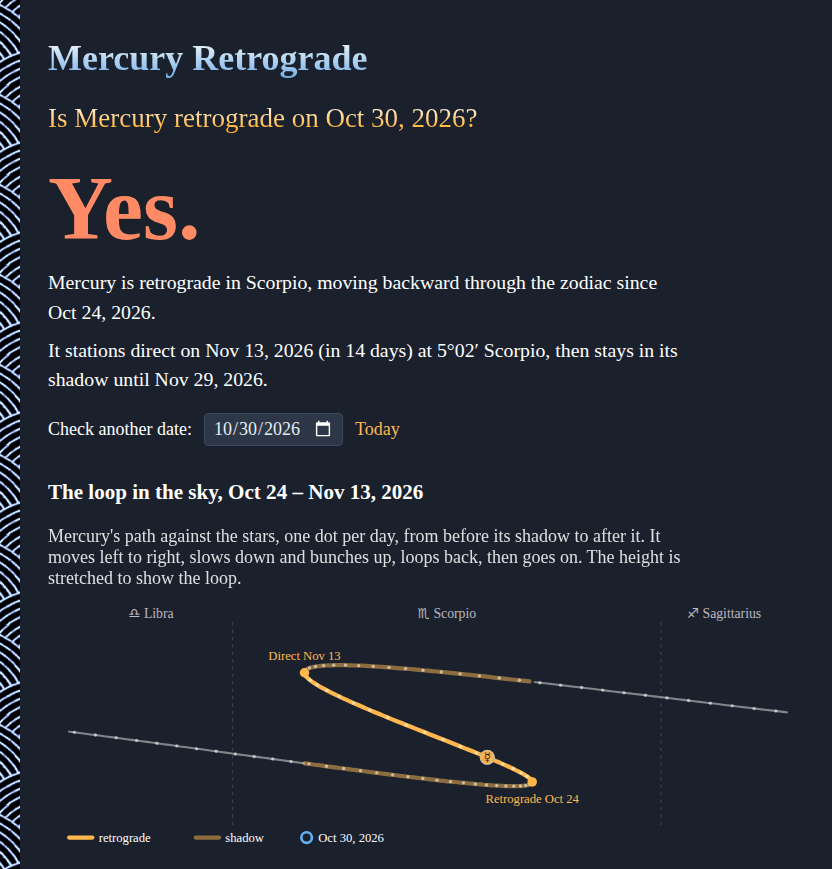
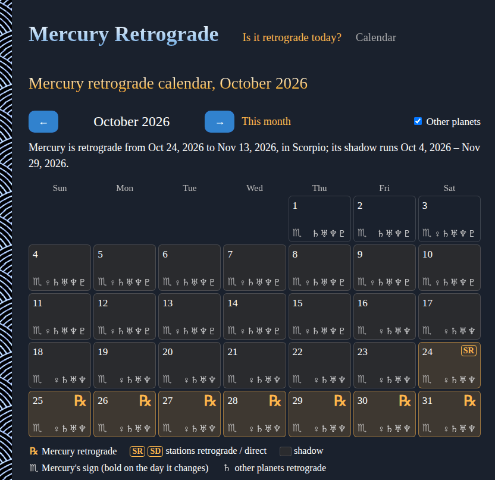

# Mercury-Retrograde

Is Mercury retrograde today? The answer for today or any date, right in your browser, with the next retrograde and its shadow periods, the loop Mercury draws in the sky, and the year's retrogrades for every planet. No sign-up and no libraries.

- [Is Mercury retrograde?](https://evoluteur.github.io/mercury-retrograde/)
- [Retrograde calendar](https://evoluteur.github.io/mercury-retrograde/calendar.html): a month at a time, day by day
- Any date: add `?date=2026-10-30` to the address, or pick one on the page

## What it does

- **The answer**: a big Yes or No for the day, where Mercury is in the zodiac, and when it next stations. Before and after a retrograde it tells you when Mercury is in its **shadow**, the stretch of sky it crosses three times.
- **The loop in the sky**: Mercury's path against the stars around the retrograde, one dot a day, so you can see it slow down, bunch up, loop back and go on.
- **Why it seems to go backward**: a view from above the Sun, with the orbits of Mercury and the Earth and the line of sight between them. Press Play, or drag the slider, to watch the line swing back as Mercury overtakes the Earth on the inside track.
- **The calendar**: a month at a time, with a mark on each day Mercury is retrograde (℞), the days it stations (SR, SD), its shadow, the sign it is in, and the other planets that are retrograde. Click a day to see it on the main page; the arrow keys go from month to month.

  

- **The year**: every planet's retrogrades and shadows in a year, from Mercury to Pluto, as a timeline and a table with the dates and zodiac degrees of the stations. Use the arrows to go from year to year.

Dates are shown in your time zone, and the signs are those of the tropical zodiac.

## How it is computed

The planet positions are computed in the browser, in [js/astro.js](https://github.com/evoluteur/mercury-retrograde/blob/main/js/astro.js), from the Keplerian orbital elements of NASA JPL's [Approximate Positions of the Planets](https://ssd.jpl.nasa.gov/planets/approx_pos.html) (valid 1800 to 2050).

- Each planet's position around the Sun comes from its orbit (solving Kepler's equation), then the Earth's position is subtracted to get where the planet appears from here, as a longitude along the zodiac.
- A planet is **retrograde** while that longitude goes down. The **stations** are the moments its speed crosses zero, found to the minute by bisection.
- The **pre-shadow** starts when the planet first reaches the degree where it will later station direct; the **post-shadow** ends when it gets back to the degree where it stationed retrograde.

That lands the stations within minutes to a few hours of the published ephemerides, plenty for dates shown by the day. For example, for 2026 it gives Mercury retrograde from Feb 26 to Mar 20, Jun 29 to Jul 23 and Oct 24 to Nov 13 (20°58′ to 5°02′ Scorpio).

## How it is built

Plain HTML, CSS and JavaScript, with no dependencies and no build step. Just open `index.html`.

- The charts are SVG, drawn at the width they are shown at so the text stays readable on phones.
- Three color themes (dark, light and blue) are shared with my other projects (copied from [omg-themes](https://github.com/evoluteur/omg-themes)).

Mercury-Retrograde is open source at [GitHub](https://github.com/evoluteur/mercury-retrograde) with MIT license.

Had fun browsing the app? [Buy me a coffee by becoming a sponsor](https://github.com/sponsors/evoluteur).

Other sky calendars: [Moon-Phase-Calendar](https://github.com/evoluteur/moon-phase-calendar) ([demo](https://evoluteur.github.io/moon-phase-calendar/)), [Eclipse-Calendar](https://github.com/evoluteur/eclipse-calendar) ([demo](https://evoluteur.github.io/eclipse-calendar/)) and [Meteor-Shower-Calendar](https://github.com/evoluteur/meteor-shower-calendar) ([demo](https://evoluteur.github.io/meteor-shower-calendar/)).

You may also enjoy [Music-of-the-Spheres](https://github.com/evoluteur/music-of-the-spheres) ([demo](https://evoluteur.github.io/music-of-the-spheres/)). For more mystic arts as small web apps, see [Esoterica](https://evoluteur.github.io/esoterica.html).

Copyright (c) 2026 [Olivier Giulieri](https://evoluteur.github.io/).
